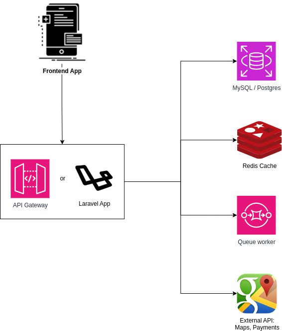

# 🏗️ Architecture Proposal – Ridely Project

## 🎯 Overview

This proposal aims to ensure scalability, security, and separation of responsibilities in an urban mobility system. The current application is a Laravel/PHP monolith but can evolve into a service-oriented architecture with a few adjustments.

---

## 🧱 High-Level Diagram

```plaintext
[Frontend App]
     |
     v
[API Gateway / Laravel App] --> [PostgreSQL/MySQL]
                         \
                          +--> [Redis Cache]
                          +--> [Queue Worker]
                          +--> [External APIs: Maps, Payments]
```


## 🧩 Domains (Bounded Contexts)

| Domain       | Responsibility                                    |
|--------------|---------------------------------------------------|
| Passengers   | Registration, identification, preferences         |
| Drivers      | Location, availability, vehicles                  |
| Rides        | Request, assignment, status, cancellation         |
| Payments *   | Price estimation and future transaction handling  |

---

## 🔌 Service Communication

- **Internally**: RESTful JSON (Laravel Controllers + Eloquent ORM)
- **Asynchronous (future)**: Message queues for events such as:
  - `RideRequested`
  - `DriverAssigned`
  - `RideCancelled`

---

## 📈 Scalability Strategy

- Stateless app → horizontal scaling with containers
- Separate workers to handle queues (e.g., `ride:assign`)
- Partitioned database (by region, if needed)
- Cache frequently accessed data (Redis)

---

## 🔐 Security

- JWT authentication (easy integration with mobile/web apps)
- Rate limiting by IP/token
- Audit logging (using Monolog or Sentry)
- Sensitive data encrypted at rest

---

## 🔍 Observability

- Structured logging with Monolog + JSON
- APM monitoring via New Relic or Sentry
- Distributed tracing (e.g., OpenTelemetry – planned)

---

## 🚀 Deployment and Infrastructure

- Docker containers
- CI/CD with GitHub Actions and ECS (or similar)
- Configuration via `.env` and `.env.production`
- Infrastructure as Code suggested: **Terraform + AWS**

