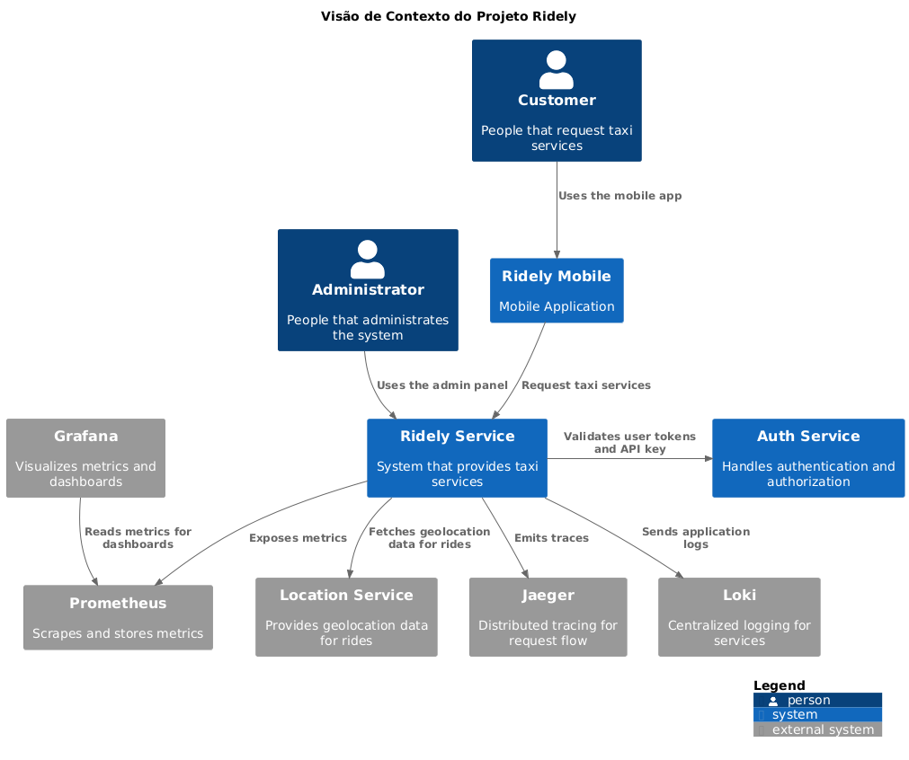

# Ridely - Plataforma de Corridas por Táxi (PHP Backend Test - Architecture Challenge)

**Ridely** é uma plataforma de transporte urbano voltada para a cidade de Aracaju. A solução oferece um ecossistema completo e escalável para corridas de táxi, construído com foco em desempenho, segurança, observabilidade e extensibilidade.

Esta monorepo abrange **backend, infraestrutura como código, documentação, automação, testes e orquestração**, proporcionando um ambiente produtivo para desenvolvimento local, homologação e produção.

## Índice

- [Visão Geral da Solução](#visão-geral-da-solução)
- [Estrutura do Projeto](#estrutura-do-projeto)
- [Arquitetura do Sistema](#arquitetura-do-sistema)
- [Serviços Principais](#serviços-principais)
- [Como Rodar Localmente](#como-rodar-localmente)
- [Como Fazer Deploy](#como-fazer-deploy)


## Visão Geral da Solução

A arquitetura do Ridely foi pensada para garantir **alta coesão e baixa acoplagem**, baseada em microsserviços e padrões modernos de deployment e segurança:

| **Camada**          | **Tecnologias / Estratégias**                                                             |
|---------------------|-------------------------------------------------------------------------------------------|
| **Backend**         | PHP (Laravel) e Node.js (Express) estruturados em microserviços                           |
| **Proxy**           | NGINX como reverse proxy local, com suporte a múltiplos domínios e roteamento de serviços |
| **Orquestração**    | Kubernetes com Helm Charts para deploy de serviços e bancos de dados                      |
| **API Gateway**     | Kong configurado para roteamento, autenticação, rate limiting e integração com Keycloak   |
| **Autenticação**    | Keycloak (OAuth2/OpenID Connect) como provedor de identidade                              |
| **Mensageria**      | RabbitMQ para comunicação assíncrona entre serviços                                       |
| **Infraestrutura**  | Provisionamento com Terraform e automações via Ansible                                    |
| **Testes**          | Suporte completo a testes E2E, integração, carga, performance, regressão e segurança      |
| **Observabilidade** | Grafana, Prometheus, Loki, Jaeger e OpenTelemetry para métricas, logs e tracing           |
| **Documentação**    | Diagramas de arquitetura, queries úteis e coleções do Postman incluídas no repositório    |

---
## Estrutura do Projeto
Abaixo, uma visão geral dos diretórios:

```
root/
├── backend/                 # Serviços de backend e seus respectivos charts Helm
│   ├── charts/              # Charts Helm para os serviços
│   └── services/            # Código para os serviços
│
├── databases/               # Charts Helm para bancos de dados e caches
│   └── charts/
│
├── docs/                    # Documentação técnica e operacional
│   ├── architecture/        # Diagramas e documentos arquiteturais
│   │   └── diagrams/
│   ├── collections/         # Collections do Postman para testes de API
│   ├── useful-queries/      # Scripts SQL úteis para debugging ou manutenção
│   ├── ARCHITECTURE.md      # Documento detalhado da arquitetura
│   └── SCALABILITY.md       # Estratégias de escalabilidade
│
├── frontend/                # Placeholder para os frontends (web/mobile)
│   ├── apps/                # Aplicações frontend (futuramente)
│   └── charts/              # Charts Helm correspondentes
│
├── infrastructure/          # Provisionamento de infraestrutura com Terraform e Ansible
│   ├── ansible/             # Arquivos de configuração do Ansible
│   ├── terraform/           # Arquivos de configuração do Terraform
│   │   ├── environments/    # Configurações de ambiente
│   │   └── modules/         # Módulos reutilizáveis (ex: EKS, VPC, etc)
│
├── observability/           # Monitoramento, logs, tracing e dashboards
│   ├── charts/              # Helm charts para Prometheus, Grafana, Loki e Jaeger
│   │   ├── prometheus/
│   │   ├── grafana/
│   │   ├── loki/
│   │   └── jaeger/
│   ├── instrumentation/     # Configurações e SDKs OpenTelemetry para Laravel e Node.js
│   │   ├── laravel/
│   │   └── nodejs/
│   ├── dashboards/          # Dashboards Grafana exportados (JSON)
│   └── alerts/              # Regras de alertas para Prometheus e Grafana
│
├── scripts/                 # Scripts utilitários e automações
│   ├── docker/              # Scripts relacionados ao Docker
│   ├── helm/                # Scripts relacionados ao Helm
│   ├── kind/                # Scripts relacionados ao KIND
│   ├── kubectl/             # Scripts relacionados ao kubectl
│   ├── nginx/               # Scripts relacionados ao NGINX (se usado)
│   ├── plantuml/            # Scripts relacionados ao PlantUML
│   └── run-local.sh         # Script principal para rodar o projeto localmente
│
├── tests/                   # Testes automatizados de várias naturezas
│   ├── e2e/                 # Testes ponta a ponta
│   ├── integration-tests/   # Testes de integração
│   ├── load-tests/          # Testes de carga
│   ├── performance-tests/   # Testes de performance
│   ├── regression-tests/    # Testes de regressão
│   └── security-tests/      # Testes de segurança
│
├── CHALLENGE.md             # Descrição técnica ou desafio de proposta do projeto
├── README.md                # Este documento
└── TODO.md                  # Tarefas pendentes e planejamento

```

## Arquitetura do Sistema
A arquitetura da plataforma **Ridely** adota uma abordagem baseada em **microserviços** e **infraestrutura distribuída**, com foco em modularidade, escalabilidade e observabilidade.
O sistema Ridely utiliza aplicações móveis e painel administrativo, com microserviços principais para gestão de corridas, autenticação e cálculo de tarifas dinâmicas.

A arquitetura adota:

* **API Gateway Kong** para roteamento e controle de acesso;
* Microsserviços em **Laravel** e **Node.js** com persistência em bancos MySQL e PostgreSQL, além de cache em Redis;
* Comunicação assíncrona via **RabbitMQ**;
* Autenticação baseada em **Keycloak** (OAuth2/OpenID Connect);
* Observabilidade completa com **Prometheus**, **Grafana**, **Loki** e **Jaeger** para métricas, logs e tracing distribuído.

Essa solução garante alta disponibilidade, escalabilidade e monitoramento eficaz.


### Diagrama de contexto


> 🔍 Para detalhes visuais e documentações técnicas aprofundadas, consulte:
>
> * [`docs/ARCHITECTURE.md`](docs/ARCHITECTURE.md)
> * [`docs/SCALABILITY.md`](docs/SCALABILITY.md)


### Arquitetura Kubernetes?

## Serviços Principais

* **Ridely Service**
  Serviço central que gerencia a lógica das corridas, incluindo solicitações, status e histórico. Desenvolvido em Laravel, interage com banco de dados MySQL e cache Redis.
  Calcula tarifas dinâmicas das corridas com base em variáveis contextuais. utiliza Redis para cache e eventos relacionados a preços.

* **Auth Service**
  Responsável pela autenticação e autorização dos usuários, utilizando Keycloak para emissão e validação de tokens via OAuth2/OpenID Connect. Persiste dados em banco PostgreSQL.

  

## Instalando as dependencies do projeto

...

### Preparando o ambiente

#### Criando o cluster
Execute o comando a seguir na raiz do projeto:
```bash
  ./scripts/kind/kind-create-cluster.sh
```
#### Configurando o contexto
Execute o comando a seguir na raiz do projeto:
```bash
  ./scripts/kubectl/kubectl-config-context.sh
```
#### Criando o namespace
Execute o comando a seguir na raiz do projeto:
```bash
  ./scripts/kubectl/kubectl-create-namespace.sh 
```


## Como Rodar Localmente

### Aplicação completa
Execute o comando a seguir na raiz do projeto:
```bash
  ENVIRONMENT_TYPE=dev skaffold dev --no-prune --namespace=ridely
```

### Apenas databases
Execute o comando a seguir na raiz do projeto:
```bash
  ENVIRONMENT_TYPE=dev skaffold dev --no-prune -p databases-only --namespace=ridely
```

### Apenas a autenticação
Execute o comando a seguir na raiz do projeto:
```bash
  ENVIRONMENT_TYPE=dev skaffold dev --no-prune -p auth-service-only --namespace=ridely
```

### Apenas a aplicação PHP + Banco de Dados
Execute o comando a seguir na raiz do projeto:
```bash
  ENVIRONMENT_TYPE=dev skaffold dev --no-prune -p ridely-service-only --namespace=ridely
```
