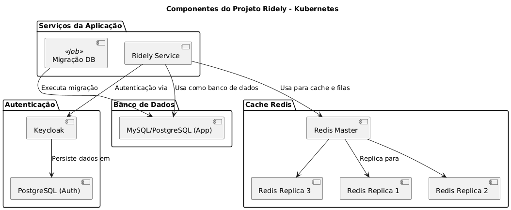
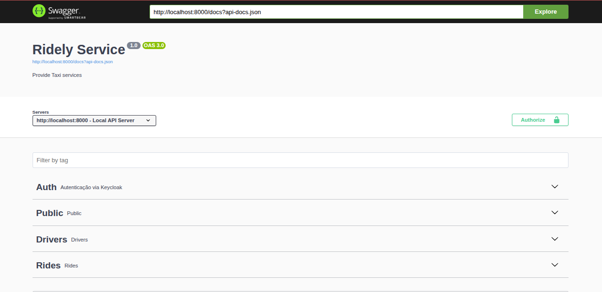

# Ridely Service
- Core service that manages ride logic, including requests, status, and history.
- Calculates dynamic ride fares based on contextual variables.
- Developed in Laravel, interacts with MySQL database and Redis cache.
- Uses Redis for queues and price-related events.

## Service Architecture
Diagrams describing the system architecture.


## Service Routes
Summary of the routes.

```
GET /                   Root
GET /health             Health Check
GET /status             Service Status Page

GET /api/auth/*         Auth Proxy endpoints (Keycloak)
GET /api/v1/drivers/*   Driver endpoints
GET /api/v1/rides/*     Ride endpoints
```

Project routes are registered here: [routes](routes)

> For more details, see the service documentation: [api-docs.json](storage/api-docs/api-docs.json)

> Postman collection: [ridely-service.postman_collection.json](../../../docs/collections/ridely-service.postman_collection.json)

### Swagger


> This project uses Swagger for route documentation, which you can check via the link:
> http://localhost:8000/api/documentation#/

## Prerequisites
- PHP 8.1 or higher
- Composer
- Docker
- Kubernetes
- Helm
- PHP Required extensions:
  - Redis
  - Xml
  - MySQL
  - XDebug
  - Curl
  
## Stack
- PHP 8
- Helm
- Kubernetes
- Docker
- MySQL
- Redis
- Redis Streams
- Nginx
- PHP-FPM
- Laravel
- Keycloak
- ~~Kong~~

## Features
- Migrations
- RESTful && HATEOS
- Support for API versions
- OpenApi/Swagger
- HealthCheck
- Status Page
- Manager Facades
  - Useful to deal with different service versions.
- ~~Github Actions~~
- Tests
  - Unit
  - Integration
- Coverage Reports
- ~~Code Formatting~~
- ~~Commit standards~~
- ~~Code Quality with Sonar~~
- ~~CI/CD Setup files~~

## Installing

Bellow there are the installation steps to be followed.


### Project dependencies
To install the projects dependencies.

Execute the follow commando:
```bash
    composer install
```

> Note: Initially you don't need to change the .env values, because it is configured for the local development.

### Application setup
First generate the application key.
```bash
  php artisan key:generate
```


## Development

Bellow there are some tips that can be helpful for you during the development.

### Checking the PHP dependencies 
Check if your system has the required extensions.

```bash
    php -m
```

#### Install the PHP dependencies
```bash
    sudo apt install php8.1-xml
    sudo apt install php8.1-curl
    sudo apt install php8.1-mysql
    sudo apt install php8.1-redis
    sudo apt install php8.1-xdebug
```

### Environment setup
After this setup the environment file:
```bash
  cp .env.example .env
```

### Running the Migrations
Now you need to run the migrations of the database (if you are running the application locally).
There is in the helm chart a Kubernetes Job that will do it for you.

```bash
  ./scripts/setup-db.sh
```

### Starting the local server
Execute the following command to start the PHP native server.
```bash
    php artisan serve
```

### Starting the worker to process the Queue
The service has some background task, so you need to run it.
Execute the following command:
```bash
    php artisan queue:process-ride-estimates
```


### Update API Documentation
To update the project Open API documentation, run the following command:

```bash
    ./scripts/init.sh
```
> The Open API schemas are stored here: [OpenApi](app/Http/OpenApi)

## Tests

### Coverage Reports
The test coverage reports will be store here in the `target` folder.

### Unit Tests
To run the unit test execute the following command:
```bash
    composer run test-unit
```
For tests with coverage, execute:
```bash
    composer run test-unit:coverage
```

### Integration Tests
To run the unit test execute the following command:
```bash
    composer run test-integration
```
For tests with coverage, execute:
```bash
    composer run test-integration:coverage
```

### Load Tests
The main project have more tests, in special load tests managed by the artillery, maybe you can take a look here: 
[load-tests](../../../tests/load-tests)

## TODO List
There are pending improvements to be done such as:
 - UUID for endpoints
 - CORS revision
 - etc

> Note: The full project TODO list is here: [TODO.md](../../../docs/TODO.md)