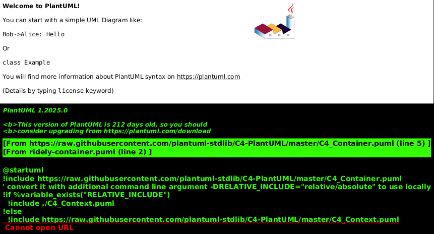
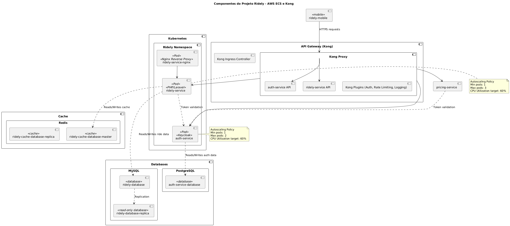
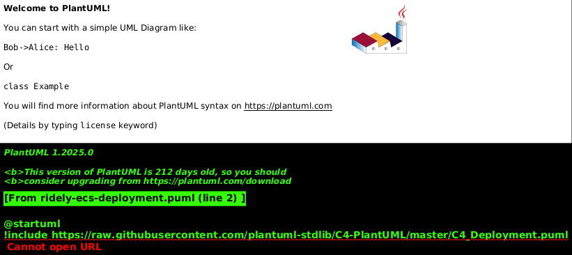
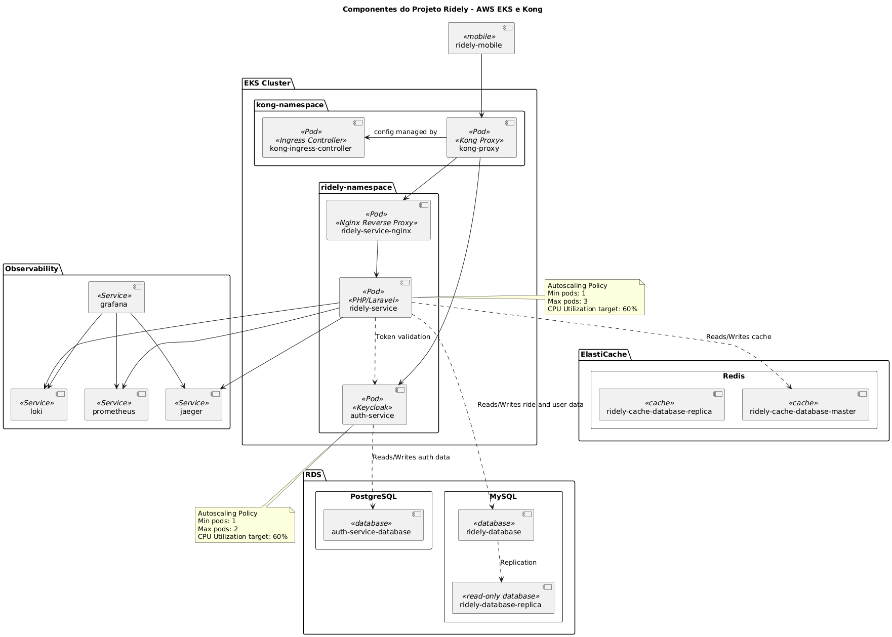
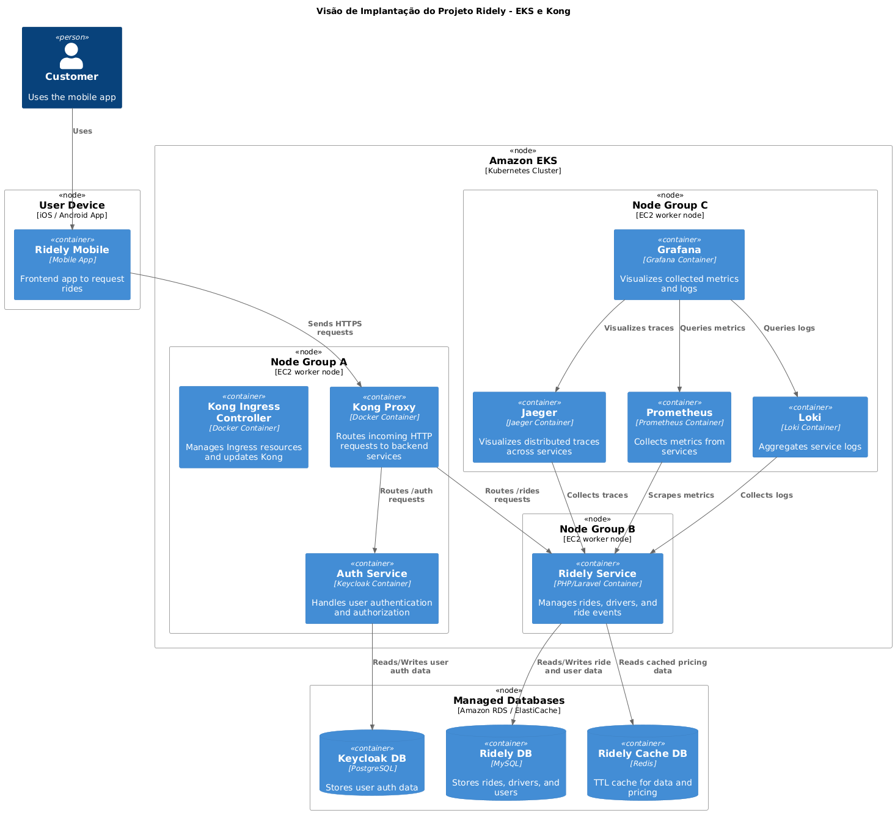
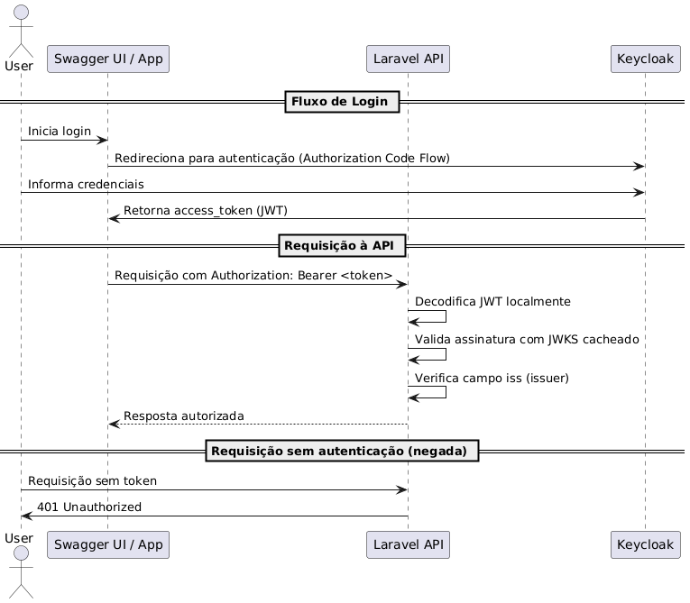
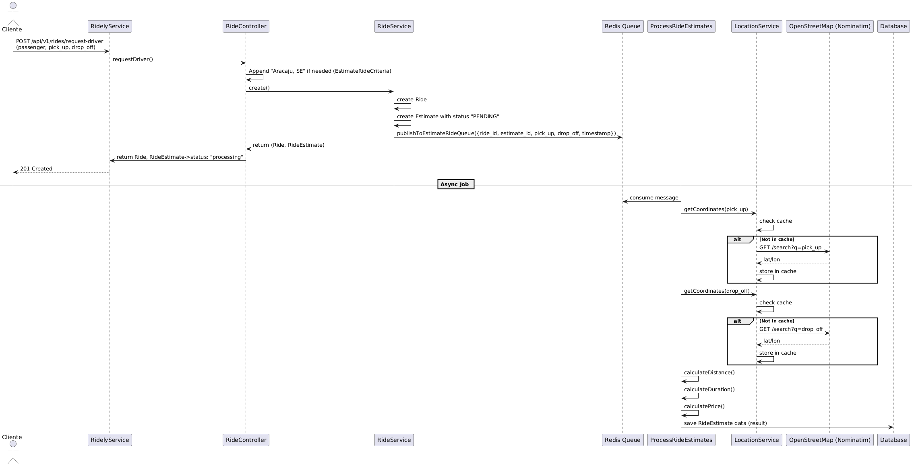
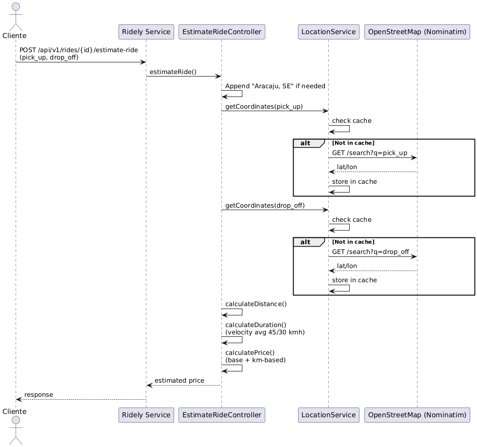

# Arquitetura
A arquitetura da plataforma **Ridely** adota uma abordagem baseada em **microserviços** e **infraestrutura distribuída**, com foco em **modularidade**, **escalabilidade** e **observabilidade**.

## Índice
- [Separação por Domínios](#separação-por-domínios)
- [Diagramas](#diagramas)
- [Arquitetura Cloud: Alternativas para Publicação do Projeto](#arquitetura-cloud-alternativas-para-publicação-do-projeto)
- [Estratégia de Escalabilidade](#estratégia-de-escalabilidade)
- [Fluxos](#fluxos)
- [Segurança](#segurança)
- [Performance](#performance)
- [Observabilidade e Monitoramento](#observabilidade-e-monitoramento)
- [Infraestrutura](#infraestrutura)
- [Integração e Entrega Contínuas (CI/CD)](#integração-e-entrega-contínuas-cicd)
- [Desenvolvimento e Testes](#desenvolvimento-e-testes)
- [Documentação](#documentação)
- [Melhorias Futuras](#melhorias-futuras)

## Separação por Domínios

A arquitetura do projeto segue o princípio de **separação por domínios**, inspirado nos conceitos de **DDD (Domain-Driven Design)**, especialmente na aplicação de **Bounded Contexts**. Cada domínio da aplicação representa uma área de negócio bem definida e é tratado de forma isolada, o que proporciona maior escalabilidade, organização e autonomia de evolução.

### Bounded Contexts

Cada contexto delimitado (*bounded context*) é tratado como uma unidade independente de responsabilidade. Isso significa que funcionalidades específicas — como **autenticação**, **corridas**, **precificação**, **usuários**, entre outros — são encapsuladas em serviços separados, cada um com suas regras de negócio, banco de dados e cache próprios.

### Arquitetura de Serviços

- **Serviços independentes** organizados por domínio de negócio;
- **Isolamento de dados**: cada serviço possui seu próprio banco de dados e instância de cache (Redis, por exemplo), evitando acoplamentos indesejados;
- **Comunicação entre domínios** planejada por meio de contratos bem definidos (REST, eventos, etc.).

### Evolução para Arquitetura Orientada a Eventos

Embora inicialmente a comunicação seja predominantemente via REST, a arquitetura foi desenhada para suportar a evolução para um modelo **orientado a eventos**, utilizando **filas e brokers de mensagens** (como RabbitMQ, Kafka ou SNS/SQS):

- **Eventos de domínio** poderão ser emitidos e consumidos de forma assíncrona;
- **Resiliência e desacoplamento** entre serviços;
- **Escalabilidade** e possibilidade de introdução de estratégias como *event sourcing* e *CQRS* no futuro.

### Benefícios

- **Alta coesão e baixo acoplamento** entre serviços;
- Facilidade de **escalabilidade horizontal** individual de contextos;
- **Segurança e controle de dados** em cada domínio;
- Base sólida para práticas como **micro frontends** ou **feature toggles** em ambientes complexos.


Essa separação clara por domínios prepara o projeto para um crescimento sustentável, facilitando tanto a manutenção quanto a evolução arquitetural ao longo do tempo.


## Diagramas
Esta seção contém os diagramas da solução.
### Diagrama de contexto  (C4 Model)


No nível de **contexto**, o sistema é composto por aplicações móveis utilizadas por clientes para solicitar corridas, além de um painel administrativo acessado por operadores do sistema. As requisições dos usuários são tratadas pelo **Ridely Service**. 
o núcleo da aplicação, responsável por gerenciar as corridas, calcular os valores dinâmicos das **corridas internamente**, e realizar autenticação via o **Auth Service** (baseado em Keycloak).

~~A comunicação entre os serviços é complementada por uma arquitetura assíncrona com **RabbitMQ**, permitindo o desacoplamento e o processamento de eventos de forma eficiente.~~

### Diagrama de Container (C4 Model)


No nível de containers, a solução é composta por:

* **API Gateway (Kong)**
  - Responsável por gerenciar todo o tráfego HTTP, roteando requisições para os microsserviços, aplicando autenticação, rate limiting, logging e outras políticas via plugins. É configurado automaticamente por meio do **Kong Ingress Controller**, que observa os recursos Ingress no Kubernetes.

- **Ridely Service**
  - Serviço central que gerencia a lógica das corridas, incluindo solicitações, status e histórico.
  - Calcula tarifas dinâmicas das corridas com base em variáveis contextuais.
  - Desenvolvido em Laravel, interage com banco de dados MySQL e cache Redis.
  - Utiliza Redis para filas e eventos relacionados a preços.
  
* **Auth Service (Keycloak)**
  - Realiza autenticação e autorização via OAuth2/OpenID Connect, emitindo tokens JWT para uso pelas aplicações clientes e microsserviços. Usa um banco Postgres para persistência dos dados de identidade.


* ~~**Mensageria com RabbitMQ**~~
  - ~~Utilizada para comunicação assíncrona entre microsserviços. Eventos como `ride.requested`, `ride.accepted`, `pricing.calculated`, entre outros, são publicados e consumidos de acordo com o fluxo da corrida.~~


* **Mensageria com Redis**
  - Utilizada para filas de tarefas e eventos relacionados ao cálculo de preços dinâmicos.


* **Observabilidade**
  - A plataforma é totalmente instrumentada:
    - **Prometheus** coleta métricas expostas pelos serviços;
    - **Grafana** consulta e exibe dashboards com dados de métricas, logs e tracing;
    - **Loki** centraliza e indexa os logs dos serviços;
    - **Fluentd** coleta e envio de logs dos serviços para o Loki;
    - **Jaeger** realiza tracing distribuído, permitindo rastrear o fluxo de uma requisição entre os microsserviços.

Essa arquitetura proporciona alta disponibilidade, rastreabilidade e controle operacional sobre todo o sistema.


## Arquitetura Cloud: Alternativas para Publicação do Projeto

Nesta seção, apresentamos duas opções de arquitetura para implantação do projeto Ridely na AWS: uma baseada em Amazon ECS e outra em Amazon EKS. Ambas as abordagens atendem aos requisitos do sistema, porém diferem em complexidade operacional, escalabilidade e custo.

A escolha entre ECS e EKS deve considerar fatores como facilidade de gestão, flexibilidade de configuração e necessidades específicas de escala e resiliência. A seguir, detalhamos cada solução, seus componentes principais e características relevantes para o projeto.


### Solução A: Arquitetura baseada em ECS + Kong

#### Descrição

A solução com **Amazon ECS** utiliza serviços gerenciados para orquestração de containers, 
com cada serviço rodando como uma tarefa ECS, podendo ser executada via Fargate ou instâncias EC2 provisionadas manualmente (EC2-backed ECS). O tráfego externo é roteado por meio do **Kong API Gateway**, que gerencia autenticação, rate limiting, logging e roteamento das requisições para os serviços backend expostos por meio de NGINX (em containers separados).

#### Componentes

* **Kong API Gateway**: Entrada para clientes externos, com controle de autenticação, roteamento e políticas aplicadas via plugins.
* **ECS + EC2-backed ECS**: Cada microserviço roda em containers isolados com auto scaling configurado.
  * Fargate (opcional): mais simples, porém com custo maior.
* **NGINX**: Reverse proxy local para os serviços PHP e Node.js.
* **RDS**: Bancos de dados MySQL e PostgreSQL gerenciados.
* **ElastiCache (Redis)**: Cache de alta performance.
* ~~**RabbitMQ**: Comunicação assíncrona entre serviços.~~


#### Diagramas
Componentes:

Implantação:



### Solução B: Arquitetura baseada em EKS + Kong

#### Descrição

A solução baseada em **EKS (Kubernetes)** usa um cluster Kubernetes para orquestração de todos os serviços, com o **Kong Gateway** instalado no cluster como controlador de entrada (Ingress Controller + Proxy). O Kong substitui o API Gateway da AWS e os proxies NGINX, oferecendo controle avançado de roteamento, autenticação e observabilidade via plugins.

#### Componentes

- **Kong Gateway (Ingress Controller)**: Exposto por um LoadBalancer, gerencia o tráfego externo.
- **EKS**: Cluster Kubernetes com namespaces separados para os serviços.
- **Pods**: Cada microserviço roda em um ou mais pods, com auto scaling por HPA.
- **RDS**: Bancos de dados MySQL e PostgreSQL gerenciados.
- **ElastiCache (Redis)**: Cache de alta performance.
- ~~**RabbitMQ**: Comunicação assíncrona entre os pods dos serviços.~~

#### Diagramas
Componentes:

Implantação:



### Solução C: Arquitetura baseada em ECS + AWS Api Gateway

#### Descrição

A solução com **Amazon ECS** usa serviços gerenciados para orquestração de containers, com cada serviço rodando como uma tarefa ECS Fargate. O tráfego externo é roteado por meio do **API Gateway da AWS**, que encaminha as requisições para os serviços backend expostos por meio de NGINX (em containers separados).

#### Componentes

- **API Gateway**: Entrada para clientes externos, com controle de autenticação e roteamento.
- **ECS + EC2-backed ECS**: Cada microserviço roda em containers isolados com auto scaling configurado.
  - * Fargate (opcional): mais simples, porém com custo maior.
- **NGINX**: Reverse proxy local para os serviços PHP e Node.js.
- **RDS**: Bancos de dados MySQL e PostgreSQL gerenciados.
- **ElastiCache (Redis)**: Cache de alta performance.
- ~~**RabbitMQ**: Comunicação assíncrona entre serviços.~~

#### Diagramas
Componentes:

Implantação:


### Comparativo Geral

| Critério                 | ECS + API Gateway (AWS)              | ECS + Kong                   | EKS + Kong                         |
|--------------------------|--------------------------------------|------------------------------|------------------------------------|
| Complexidade Operacional | Baixa                                | Média                        | Alta (mais controle/flexibilidade) |
| Custo Inicial            | Menor (mais gerenciado)              | Médio                        | Maior (infraestrutura dedicada)    |
| Escalabilidade           | Baixa (EC2-backed) / Média (Fargate) | Média (Fargate + Kong)       | Alta (horizontal com HPA)          |
| Flexibilidade            | Limitada ao ecossistema AWS          | Moderada (Kong com ECS)      | Alta (padrões CNCF, portável)      |
| Observabilidade          | Integrada (CloudWatch)               | Customizável (OpenTelemetry) | Customizável (OpenTelemetry)       |
| Gateway/API              | AWS API Gateway + NGINX              | Kong Gateway (em ECS)        | Kong Gateway (Ingress + Plugins)   |

---

### Considerações Finais

A escolha entre os cenários dependerá de:

* **Etapa do projeto**: ECS + API Gateway pode ser mais simples para MVPs.
* **Controle e Flexibilidade**: ECS + Kong oferece mais controle que o API Gateway AWS, com menos complexidade que EKS.
* **Equipe**: EKS exige maior familiaridade com Kubernetes.
* **Custo x Controle**: EKS tende a apresentar custos maiores, mas oferece controle mais refinado e escalabilidade avançada.

Todas as soluções são compatíveis com Terraform, Ansible e Helm Charts.

> Nota: Para a solução atual deste desafio eu optei por montar as configurações para um cenário de EKS.


## Estratégia de Escalabilidade

### Escalabilidade Horizontal

A arquitetura da solução foi desenhada com foco em **escalabilidade horizontal** e resiliência. Abaixo estão os principais pontos que contribuem para isso:

- **Redis com réplicas** configuradas, garantindo maior disponibilidade e capacidade de leitura em escala;
- **Banco de dados com réplica de leitura (read-only)** planejada, permitindo distribuir a carga entre operações de leitura e escrita;
- **Serviço PHP configurado com NGINX (proxy reverso) + PHP-FPM**, promovendo melhor gerenciamento de conexões e desempenho sob carga;
- O serviço pode **escalar horizontalmente até 4 instâncias** (via Horizontal Pod Autoscaler) com base em métricas como uso de CPU;
- A infraestrutura baseada em containers permite o uso em **ambientes escaláveis como ECS ou EKS**, garantindo elasticidade conforme demanda.

Essa abordagem garante que o sistema se mantenha responsivo mesmo sob altos volumes de requisição, com capacidade de crescimento gradual.

### Escalabilidade Vertical

Além da escalabilidade horizontal, a solução também permite **escalabilidade vertical** de forma simples e controlada. Como os serviços são empacotados em **containers** e orquestrados por meio de **Helm Charts**, é possível ajustar facilmente os recursos alocados (CPU e memória) conforme a demanda.

Esse ajuste pode ser feito em diferentes ambientes (desenvolvimento, staging e produção) com apenas uma mudança nas configurações do Helm, facilitando a adaptação conforme o perfil de carga ou requisitos de desempenho dos serviços.

Essa flexibilidade permite, por exemplo:
- Aumentar a capacidade de processamento de serviços críticos sem alterar a arquitetura;
- Ajustar limites e requests de recursos conforme a observabilidade e os testes de carga;
- Aplicar diferentes perfis de performance por ambiente com segurança.

Esse modelo garante **otimização de custo** e **resposta rápida a variações de carga**, mantendo a plataforma robusta e performática.


## Fluxos

### Fluxos de Autenticação

A plataforma Ridely adota uma abordagem mista para autenticação, integrando o serviço de identidade **Keycloak** com middleware próprio no serviço backend em PHP.

#### Visão Geral

- A autenticação de usuários é baseada em **OAuth2/OpenID Connect**.
- O **Keycloak** é o provedor de identidade (IdP), responsável por emitir tokens JWT.
- A API escrita em PHP (Laravel) **não implementa autenticação diretamente**; em vez disso, **atua como um proxy para o Keycloak** nos fluxos de autenticação interativa.

#### Fluxo de Autenticação Interativa (Login/Logout)

1. O cliente (app mobile ou Swagger UI) redireciona o usuário para o Keycloak.
2. O usuário realiza login no Keycloak.
3. O Keycloak retorna um **access token (JWT)**.
4. O cliente usa esse token para autenticar requisições subsequentes na API Ridely.

> **Nota**: No ambiente de desenvolvimento, ou em ferramentas como o Swagger, a API PHP fornece endpoints que fazem proxy para o Keycloak, simplificando a autenticação manual por meio da interface interativa.

#### Middleware de Autenticação

- A API PHP possui um **middleware responsável por validar tokens JWT**.
- O middleware:
  - Consulta os metadados do Keycloak (endpoint `.well-known/openid-configuration`).
  - Obtém e cacheia as **chaves públicas (JWKS)** utilizadas para validar a assinatura dos tokens.
  - Valida e decodifica o token JWT em cada requisição autenticada.
  - **Evita requisições repetidas ao Keycloak** ao manter as JWKS em cache por um período configurável.

> **Nota**: Essa abordagem previne que requisições sejam feitas diretamente ao serviço sem autenticação por meio da rede interna do cluster.

Além da validação da assinatura do token JWT, o serviço de API também executa verificações adicionais, como a análise do campo `iss` (issuer) do token, garantindo que ele tenha sido emitido de fato pelo Keycloak. Isso adiciona uma camada de segurança extra, evitando tentativas de falsificação ou uso de tokens inválidos.

Embora atualmente o controle de autenticação e autorização seja feito diretamente na camada de aplicação, o projeto prevê que, em ambientes produtivos, essa responsabilidade será transferida para um **API Gateway** dedicado — como o **Kong**, solução escolhida para esse papel. O gateway atuará como ponto central de controle de acesso, validação de tokens e roteamento seguro, protegendo os serviços internos de chamadas indevidas e centralizando as políticas de segurança da plataforma.

##### Diagramas


### Fluxo de Cálculo de Preço Estimado


#### Fluxo Assíncrono (Padrão)

Para atender requisitos de escalabilidade e resiliência, uma futura melhoria propõe a transformação do processo em **assíncrono**.

Nesse modelo, ao realizar a requisição de estimativa, o cliente recebe imediatamente uma resposta com:

- Os dados da corrida
- A estimativa com o status `"PENDING"` 

Os dados da solicitação são então enfileirados em uma **fila Redis**.

Um **job worker assíncrono** consome a fila e executa os mesmos passos do fluxo síncrono:

- Obtenção das coordenadas (com cache)
- Cálculo da distância
- Estimativa de tempo
- Cálculo do valor da corrida

Ao final, os dados são **persistidos em banco de dados**.

O cliente pode consultar o resultado por meio do endpoint:

```
  GET /api/v1/rides/{id}/estimate-ride
```

Ou no endpoint da propria corrida:
```
  GET /api/v1/rides/{id}
```
  

##### Diagramas



#### Fluxo Síncrono (Fallback manual)

O cálculo do preço estimado é realizado de forma síncrona, diretamente no endpoint:
```
  POST /api/v1/rides/{id}/estimate-ride
```

O cliente faz a requisição para o endpoint. Caso os nomes das ruas não incluam a cidade e o estado, o sistema os complementa automaticamente com “Aracaju, SE”.

Para cada endereço, o sistema verifica se já existe uma entrada cacheada (via hash MD5). Se não houver, uma requisição é enviada ao serviço externo **Nominatim (OpenStreetMap)** para obtenção das coordenadas geográficas (latitude e longitude).

Com essas coordenadas, calcula-se a distância entre os dois pontos. A partir disso, o tempo estimado de viagem é calculado com base em velocidades médias definidas:

- **45 km/h** em horários normais
- **30 km/h** em horários de pico

O preço é então calculado com base em regras tarifárias:

- Horários de rush possuem tarifa base + preço por km
- Após as **17h** ou antes das **7h**, aplica-se a **bandeira 2**, com valores diferenciados

O resultado do cálculo é retornado ao cliente, os dados são persistidos no banco de dados.

##### Diagramas



### Demais Fluxos

Esta seção será dedicada a descrever os fluxos principais da plataforma Ridely relacionados a:

- Solicitação de corrida
- Atribuição de motorista
- Estimativa de preço e duração
- Início, acompanhamento e finalização da corrida
- Cancelamento de corridas
- Atualização de localização
- Comunicação entre serviços (eventos assíncronos via Redis)

> *Nota: Esses fluxos não serão explorados aqui neste momento.*

## Segurança

A plataforma Ridely adota uma abordagem consciente em relação à segurança desde as camadas iniciais da aplicação. As principais medidas implementadas até o momento incluem:

- **Tratamento seguro de exceções e logs**: Foi realizado um trabalho de revisão e sanitização das mensagens de erro e dos logs de sistema para evitar a exposição de informações sensíveis, como rastreamentos de stack (`stack traces`), dados internos de exceções, variáveis de ambiente e detalhes de banco de dados.
- **Health Check inteligente e página de status**: O sistema conta com endpoints de *health check* configurados para retornar apenas informações essenciais para monitoração, sem expor detalhes sobre o estado interno da aplicação. Além disso, uma página de status pública foi criada com base em dados limitados, colaborando para visibilidade sem comprometer a segurança.
- **Autenticação aplicada aos endpoints**: Todos os endpoints críticos da API estão protegidos por autenticação via JWT. A aplicação realiza validações locais do token, como assinatura e verificação do emissor (`iss`), evitando a necessidade de comunicação constante com o provedor de identidade (Keycloak).
- **Uso de UUIDs públicos**: Quando possível, identificadores do tipo UUID são utilizados em vez de IDs sequenciais, minimizando o risco de ataques de enumeração de recursos (*ID enumeration*).
- **Rate limiting e throttling**: Aplicação de limites de requisição por cliente/autorização, tanto via API Gateway quanto na própria API, para mitigar ataques de força bruta e abusos de uso.
- **Validação CORS restritiva**: As regras de CORS foram configuradas para permitir apenas domínios autorizados, prevenindo requisições cross-origin indesejadas em ambientes de frontend e documentação (ex: Swagger).


### Oportunidades Futuras

- **Circuit Breaker e Timeout inteligente**: Adoção de mecanismos de *circuit breaker* para isolar falhas e evitar a propagação de erros em cascata entre serviços, além de timeouts controlados para garantir respostas previsíveis e seguras.
- **Integração com Web Application Firewall (WAF)**: Uso de WAFs (como o da AWS ou embutido no Kong) para proteger contra ataques comuns como injeções SQL, XSS, e exploração de vulnerabilidades conhecidas.
- **Auditoria e rastreabilidade (Audit Trail)**: Implementação de mecanismos de auditoria para rastrear ações críticas de usuários e serviços, com armazenamento seguro e integridade garantida.

- **Criptografia em repouso e em trânsito**: Garantia de uso de TLS para comunicação entre serviços e criptografia nos volumes persistentes sensíveis (banco de dados, cache, etc.).
- **Segurança de rede**:
  - **Políticas de rede no Kubernetes**: Implementação de políticas de rede para restringir a comunicação entre pods, garantindo que apenas serviços autorizados possam se comunicar.
  - **Segregação de ambientes**: Uso de namespaces e redes separadas para ambientes de desenvolvimento, teste e produção, minimizando o risco de vazamento de dados entre eles.
- **Gestão de segredos e credenciais**:
  - **Kubernetes Secrets**: Uso de segredos do Kubernetes com criptografia em repouso.
  - **Sealed Secrets + SOPS**: Implementação de Sealed Secrets para versionamento seguro em GitOps, utilizando ferramentas como Helm ou Kustomize.
  - **Política segura de versionamento de segredos**: Definição de práticas para versionamento seguro de segredos, evitando exposição acidental.
  - **Integração com AWS Secrets Manager**: Planejamento para uso do AWS Secrets Manager em ambientes de produção, garantindo gerenciamento centralizado e seguro de segredos.


Essas medidas visam garantir não apenas a segurança do ambiente atual, mas também preparar a aplicação para requisitos mais exigentes de produção, como compliance com normas de segurança e escalabilidade segura.

## Performance

A performance do sistema Ridely é continuamente monitorada e aprimorada, com foco na escalabilidade horizontal, resposta rápida e uso eficiente de recursos. A seguir, destacam-se os principais pontos relacionados a desempenho:

### Testes de Carga

Os testes de carga são versionados no próprio repositório do projeto e utilizam ferramentas como **Artillery** ou **k6**, com cenários configuráveis para:

- Avaliar o comportamento da API sob diferentes taxas de requisição (`arrivalRate`)
- Simular múltiplos usuários e jornadas distintas (autenticados e anônimos)
- Testar pontos críticos como estimativas de corrida, autenticação e cache
- Coletar métricas de latência, throughput, taxa de erro e consumo de recursos

Esses testes são fundamentais para identificar gargalos antes da produção e validar configurações de escalabilidade.

### Estratégias de Escalabilidade

O projeto já implementa **Horizontal Pod Autoscaler (HPA)** para os principais serviços, com base no uso de **CPU** e potencialmente de **métricas customizadas** (ex: tempo de resposta, filas, etc.). Isso permite que o sistema aumente ou reduza automaticamente o número de réplicas com base na demanda real.

Exemplo:
```yaml
metrics:
  - type: Resource
    resource:
      name: cpu
      target:
        type: Utilization
        averageUtilization: 60
```

Além disso, os containers seguem boas práticas com requests e limits bem definidos, garantindo previsibilidade de uso no cluster e evitando resource contention.

### Estratégias de Cache
Parcialmente aplicadas, as estratégias de cache visam reduzir a latência e a carga nos serviços e bancos de dados:

- Redis foi implementado com uma estrutura mestre + réplicas para leitura escalável.
  - Algumas respostas frequentes (ex: JWKS do Keycloak) são cacheadas no próprio serviço PHP com TTL.
- Futuramente, pretende-se aplicar cache em endpoints públicos, resultados de cálculo de preço, e uso de headers (ETag, Cache-Control) onde aplicável.


### Arquitetura de Containers
O projeto foi desenhado desde o início para ser executado em containers, sendo compatível com ambientes como:

- Amazon ECS (com ou sem Fargate), com suporte a task definitions, auto scaling e integração com ALB.
- Amazon EKS, com deployment via Helm Charts, observabilidade com as ferramentas descritas neste documento.
- Essa abordagem facilita o deployment em múltiplos ambientes (desenvolvimento, staging, produção) com reuso de definições e pipelines CI/CD.

### Oportunidades Futuras

Além do que já foi implementado, estão mapeadas outras ações para melhorar a performance:
- Cache distribuído com fallback local
- Uso de CDN para assets e rotas públicas (ex: estimativa de corrida para não logados)
- Compressão de payloads HTTP (GZIP/Brotli)
- Desacoplamento de fluxos assíncronos com filas (ex: eventos de corrida iniciada/concluída)
- Uso de métricas de aplicação via OpenTelemetry para detectar lentidões fora do escopo do HPA
- Implementação de perfil de execução leve para endpoints usados por webhooks ou tarefas agendadas

## Observabilidade e Monitoramento

Embora a plataforma Ridely ainda não tenha a observabilidade completamente implementada, o projeto prevê a adoção de um conjunto robusto de ferramentas para monitoramento e análise de desempenho em ambientes de **staging** e **produção**.

A observabilidade será fundamental para garantir a saúde do sistema, detectar rapidamente falhas, otimizar o desempenho e facilitar o diagnóstico de problemas complexos em uma arquitetura baseada em microserviços.

### Ferramentas previstas para instrumentação

- **Prometheus**  
  Coleta métricas detalhadas expostas pelos serviços, permitindo análise de uso de recursos, latência, taxa de erros e outros indicadores chave.

- **Grafana**  
  Plataforma para consulta, visualização e criação de dashboards personalizados que agregam dados de métricas, logs e tracing, facilitando a visualização em tempo real e histórico.

- **Loki**  
  Sistema centralizado para armazenamento e indexação de logs estruturados dos serviços, com suporte a buscas eficientes.

- **Fluentd**  
  Agente responsável por coletar logs dos containers e enviá-los para o Loki, garantindo a confiabilidade e organização das informações.

- **Jaeger**  
  Ferramenta de tracing distribuído que permite rastrear o caminho completo de uma requisição entre múltiplos microsserviços, auxiliando na identificação de gargalos e falhas em fluxos complexos.

### Considerações

A implantação dessas ferramentas será realizada de forma incremental, inicialmente em ambientes controlados para validação e ajuste, antes de seu uso em produção. Essa estratégia assegura que a observabilidade contribua de forma efetiva para a estabilidade e evolução da plataforma Ridely.

> Nota: A aplicação PHP conta com uma página de status que apresenta a saúde das principais dependências (health check). Essa funcionalidade contribui diretamente para a observabilidade, permitindo monitorar rapidamente o estado do sistema e identificar possíveis falhas nas integrações.


## Infraestrutura

A gestão da infraestrutura do projeto Ridely está planejada para ser automatizada e versionada, garantindo consistência, reprodutibilidade e agilidade no provisionamento de ambientes.

### Ambiente Local

Para desenvolvimento e testes locais, utilizamos:

- **Kind (Kubernetes in Docker)**: Permite executar clusters Kubernetes completos de forma leve e rápida em ambientes de desenvolvimento, facilitando a simulação do ambiente de produção.
- **Helm Charts**: Usados para a definição, empacotamento e gerenciamento dos recursos Kubernetes, garantindo deploys consistentes e parametrizáveis dos microsserviços e componentes auxiliares.
- **Skaffold**: Ferramenta que automatiza o ciclo de desenvolvimento com Kubernetes, facilitando o build, deploy e teste dos containers em ambiente local e remoto, acelerando o feedback para desenvolvedores.

### Infraestrutura como Código (IaC)

Para ambientes de staging e produção, o provisionamento da infraestrutura será realizado com ferramentas de Infraestrutura como Código, visando maior controle e automação:

- **Terraform**: Ferramenta declarativa para provisionamento e gerenciamento da infraestrutura na nuvem (AWS), incluindo redes, clusters Kubernetes (EKS), bancos de dados (RDS), caches (ElastiCache), entre outros recursos.
- **Ansible**: Usado para configuração e orquestração de recursos e aplicações, complementando o Terraform com tarefas específicas como deploy de configurações, instalação de componentes e gestão de segredos.

### Benefícios Esperados

A adoção dessas ferramentas possibilita:

- Versionamento e controle de mudanças da infraestrutura
- Automação do provisionamento e configuração
- Reutilização de configurações entre ambientes
- Redução de erros manuais e maior confiabilidade
- Integração facilitada com pipelines CI/CD

Essa estratégia garante que a infraestrutura do Ridely evolua de forma segura, consistente e alinhada às melhores práticas DevOps.


## Integração e Entrega Contínuas (CI/CD)

O processo de Integração Contínua (CI) e Entrega Contínua (CD) do projeto Ridely está sendo estruturado em múltiplas camadas, com foco em qualidade, automação e rastreabilidade das entregas.

### Etapas Locais

Durante o desenvolvimento, algumas validações são realizadas diretamente no ambiente do desenvolvedor:

- **Code lint**: Verificações de estilo e padronização do código para manter consistência entre contribuidores.
- **Testes de Unidade e Integração**: Execução de baterias de testes para garantir que as funcionalidades do sistema funcionem conforme esperado e continuem válidas após alterações.
- **Análise Estática (opcional)**: Possibilidade de integração local com ferramentas como SonarQube para identificar vulnerabilidades, _code smells_ e problemas estruturais no código.

### GitHub Actions

Na etapa de CI, utilizamos **GitHub Actions** para automatizar:

- Validações de lint e estilo de código.
- Execução de testes de unidade e integração.
- Geração de relatórios de cobertura de testes (_code coverage_).
- (Opcional) Análise estática com SonarQube ou outros analisadores integrados ao repositório.

Esses workflows garantem que cada pull request e merge passem por validações automatizadas, assegurando qualidade contínua do código entregue.

### Etapas Pós-CI

Em ambientes de **staging** e **produção**, outras validações e processos automatizados podem ser incluídos, como:

- **Testes de regressão automatizados**
- **Testes end-to-end**
- **Testes de performance**
- **Testes de segurança automatizados**
- Outras tarefas específicas de automação e validação conforme o projeto evolui

Esses testes complementares ajudam a garantir a estabilidade do sistema frente a alterações frequentes.

### Deploy com AWS CodePipeline

A entrega contínua está planejada para ocorrer via **AWS CodePipeline**, permitindo:

- Automação de builds, testes e deploy em diferentes ambientes.
- Integração com ferramentas como CodeBuild e CodeDeploy.
- Versionamento de builds e rastreabilidade de entregas.
- Integração direta com a infraestrutura provisionada via Terraform e Ansible.

### Estratégias de Deploy

Para aumentar a confiabilidade das entregas e possibilitar validações progressivas em produção, poderão ser aplicadas estratégias como:

- **Canary Deployments**: Liberação gradual de novas versões para subconjuntos de usuários, permitindo rollback rápido em caso de falhas.
- **A/B Testing**: Testes de funcionalidades ou interfaces diferentes para avaliar desempenho e aceitação por parte dos usuários.
- **Blue/Green Deployments**: Alternância entre dois ambientes idênticos para atualização segura de versões.


Essa estrutura de CI/CD está alinhada às melhores práticas de DevOps e oferece uma base sólida para escalar o projeto com segurança, velocidade e qualidade contínua.


 
## Desenvolvimento e Testes

O processo de desenvolvimento do projeto Ridely é guiado por boas práticas modernas de engenharia de software e DevOps. A estrutura foi pensada para escalabilidade, sustentabilidade e facilidade de manutenção, incorporando automações, documentação viva e estratégias colaborativas.

### Boas Práticas de Desenvolvimento

- **Clean Code** e princípios **SOLID** aplicados para manter legibilidade e manutenção do código.
- **DRY (Don't Repeat Yourself)** e **KISS (Keep It Simple, Stupid)** para evitar duplicação e complexidade desnecessária.
- **Revisão de Código (Code Review)** obrigatória via Pull Requests, com templates padronizados.
- **Commits Semânticos** para facilitar a leitura e rastreabilidade das mudanças.
- **Separação de responsabilidades** clara entre camadas (Controllers, Services, Repositories etc.).
- **Padrões RESTful e HATEOAS** aplicados nas APIs.
- **Testes automatizados como parte do ciclo de desenvolvimento** (unidade, integração, E2E).
- **Observabilidade desde o desenvolvimento**: health checks inteligentes, logs claros, e suporte a tracing/métricas.
- **EditorConfig e formatação padronizada** para manter consistência no código.
- **Documentação de código e da API sempre atualizada** como parte integrante das entregas.

### Estrutura e Automação

- **GitHub Templates**: Issues e PRs padronizados.
- **Workflows com GitHub Actions**:
  - Linting, testes automatizados, geração de cobertura e análise estática com Sonar.
- **Scripts utilitários**: Para tarefas repetitivas como reset de banco, run de testes, setup local.
- **Pipeline CI/CD**: Para garantir qualidade desde o push até o deploy.

### Testes Automatizados

- **Unidade**: Foco no comportamento de métodos isolados.
- **Integração**: Validações entre componentes do sistema.
- **Componente**: Testes modulares de partes compostas.
- **E2E**: Verificação de fluxos reais da aplicação.
- **Outros testes**: De regressão, performance e segurança em etapas posteriores da pipeline.

### Documentação Técnica

- **Swagger/OpenAPI**:
  - Geração automática por anotações em PHP.
  - Interface UI completa com schemas e exemplos.
- **Diagramas UML e C4**:
  - Gerados a partir de arquivos `.puml` versionados.
- **Markdown**:
  - Documentação no repositório (`README`, `CHALLENGE.md`, `TODO.md`, etc.).
- **Código como fonte da verdade**: A documentação reflete diretamente a implementação.

### Infraestrutura como Código (IaC)

- **Localmente**:
  - Uso de **Kind**, **Helm Charts** e **Skaffold** para orquestração e desenvolvimento.
- **Provisionamento futuro com**:
  - **Terraform**: Infraestrutura declarativa em nuvem (VPC, RDS, ECS/EKS, etc.).
  - **Ansible**: Configuração e automação de servidores e recursos de aplicação.

### Configuração por Ambiente

- Ambientes: `local`, `staging`, `produção`.
- Separação de variáveis e segredos com suporte a `.env` e sistemas como **AWS Secrets Manager**.
- Helm values e configs versionadas para cada ambiente.

Essa estrutura assegura que o desenvolvimento no Ridely seja consistente, confiável e alinhado com práticas modernas de engenharia de software.


## Documentação

A documentação do projeto Ridely é dinâmica e continuamente atualizada para refletir fielmente o estado atual do sistema. Ela é composta por diversos artefatos que facilitam tanto o entendimento quanto a manutenção do código:

- **Diagramas C4 e UML**  
  Os diagramas são gerados a partir de arquivos PlantUML (`.puml`) versionados no repositório do projeto. Essa abordagem permite que os diagramas estejam sempre sincronizados com a arquitetura real do sistema e possam ser facilmente atualizados conforme a evolução do projeto.

- **Documentação da API via OpenAPI (Swagger)**  
  A API é documentada utilizando anotações OpenAPI diretamente no código PHP, garantindo que a documentação esteja sempre alinhada com a implementação. Essa documentação é exposta via Swagger UI, proporcionando uma experiência interativa para consumidores da API, além de servir como fonte confiável de verdade.

- **Código como fonte da verdade**  
  O próprio código do projeto é considerado a principal fonte da verdade, minimizando discrepâncias entre documentação e implementação. O uso de ferramentas automatizadas para geração de documentação reforça essa prática.

- **Documentos em Markdown**  
  Além dos diagramas e documentação da API, o projeto mantém uma coleção de documentos em Markdown que abordam arquitetura, processos, guias de desenvolvimento e outras informações úteis para a equipe, facilitando o onboarding e o trabalho colaborativo.

- **Outros meios complementares**  
  Para facilitar o compartilhamento e colaboração, também podem ser utilizados sistemas externos como Confluence ou Google Drive, especialmente para documentos que demandem revisão contínua ou integração com outras equipes.

Essa combinação de práticas assegura que a documentação do Ridely seja acessível, precisa e útil para desenvolvedores, arquitetos e demais stakeholders ao longo do ciclo de vida do projeto.


## Melhorias Futuras
As possiveis melhorias futuras para a arquitetura e implementação do sistema estão listadas em [IMPROMENTS.md](IMPROMENTS.md).