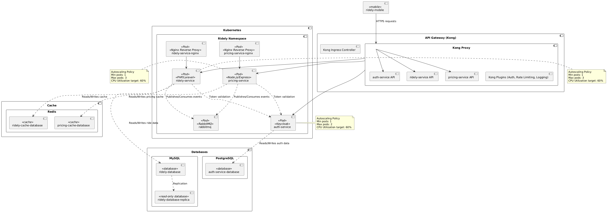
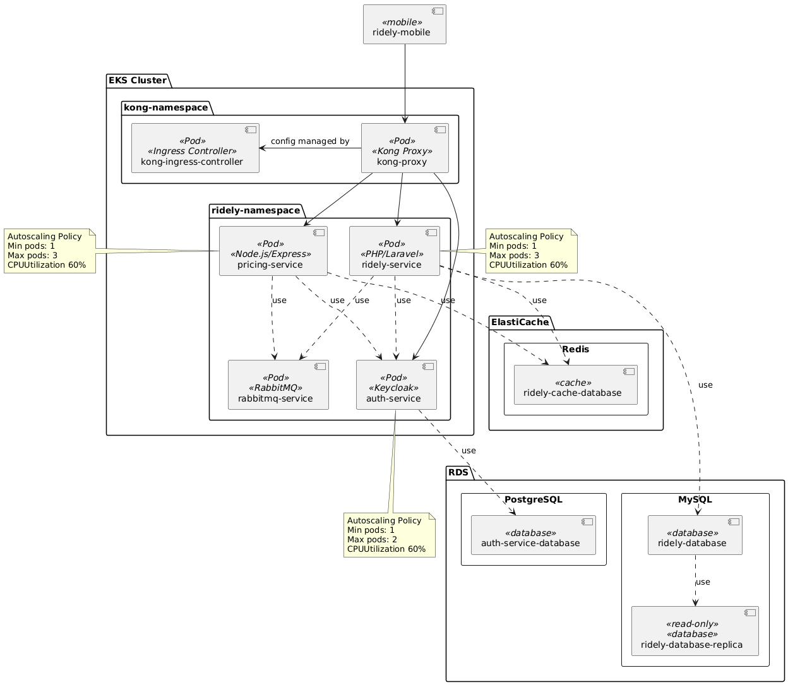

# Arquitetura
A arquitetura da plataforma **Ridely** adota uma abordagem baseada em **microserviços** e **infraestrutura distribuída**, com foco em modularidade, escalabilidade e observabilidade.

## Índice
- [Diagramas](#diagramas)
- [Arquitetura Cloud: Alternativas para Publicação do Projeto](#arquitetura-cloud-alternativas-para-publicação-do-projeto)
- [Segurança](#segurança)
- [Fluxos de Autenticação](#fluxos-de-autenticação)
- [Observabilidade e Logs](#observabilidade-e-logs)

## Diagramas
Esta seção contém os diagramas da solução.
### Diagrama de contexto  (C4 Model)

No nível de **contexto**, o sistema é composto por aplicações móveis utilizadas por clientes para solicitar corridas, além de um painel administrativo acessado por operadores do sistema. As requisições dos usuários são tratadas pelo **Ridely Service**, o núcleo da aplicação, responsável por gerenciar as corridas, consultar valores dinâmicos no **Pricing Service**, e realizar autenticação via o **Auth Service** (baseado em Keycloak).

A comunicação entre os serviços é complementada por uma arquitetura assíncrona com **RabbitMQ**, permitindo o desacoplamento e o processamento de eventos de forma eficiente.

### Diagrama de Container (C4 Model)

No nível de containers, a solução é composta por:

* **API Gateway (Kong)**
  Responsável por gerenciar todo o tráfego HTTP, roteando requisições para os microsserviços, aplicando autenticação, rate limiting, logging e outras políticas via plugins. É configurado automaticamente por meio do **Kong Ingress Controller**, que observa os recursos Ingress no Kubernetes.

* **Ridely Service (Laravel)**
  Núcleo da aplicação, responsável pela lógica de negócio das corridas. Interage com o banco de dados MySQL, com Redis para cache, e publica eventos no **RabbitMQ** para comunicação com outros serviços.

* **Auth Service (Keycloak)**
  Realiza autenticação e autorização via OAuth2/OpenID Connect, emitindo tokens JWT para uso pelas aplicações clientes e microsserviços. Usa um banco Postgres para persistência dos dados de identidade.

* **Pricing Service (Node.js)**
  Serviço independente que calcula tarifas dinâmicas com base em dados contextuais. Interage com Redis para armazenar estimativas temporárias, e também emite/consome eventos pelo RabbitMQ.

* **Mensageria com RabbitMQ**
  Utilizada para comunicação assíncrona entre microsserviços. Eventos como `ride.requested`, `ride.accepted`, `pricing.calculated`, entre outros, são publicados e consumidos de acordo com o fluxo da corrida.

* **Observabilidade**
  A plataforma é totalmente instrumentada:

    * **Prometheus** coleta métricas expostas pelos serviços;
    * **Grafana** consulta e exibe dashboards com dados de métricas, logs e tracing;
    * **Loki** centraliza e indexa os logs dos serviços;
    * **Jaeger** realiza tracing distribuído, permitindo rastrear o fluxo de uma requisição entre os microsserviços.

Essa arquitetura proporciona alta disponibilidade, rastreabilidade e controle operacional sobre todo o sistema.

## Arquitetura Cloud: Alternativas para Publicação do Projeto

Nesta seção, apresentamos duas opções de arquitetura para implantação do projeto Ridely na AWS: uma baseada em Amazon ECS e outra em Amazon EKS. Ambas as abordagens atendem aos requisitos do sistema, porém diferem em complexidade operacional, escalabilidade e custo.

A escolha entre ECS e EKS deve considerar fatores como facilidade de gestão, flexibilidade de configuração e necessidades específicas de escala e resiliência. A seguir, detalhamos cada solução, seus componentes principais e características relevantes para o projeto.

### Solução A: Arquitetura baseada em ECS + Kong

#### Descrição

A solução com **Amazon ECS** utiliza serviços gerenciados para orquestração de containers, com cada serviço rodando como uma tarefa ECS Fargate. O tráfego externo é roteado por meio do **Kong API Gateway**, que gerencia autenticação, rate limiting, logging e roteamento das requisições para os serviços backend expostos por meio de NGINX (em containers separados).

#### Componentes

* **Kong API Gateway**: Entrada para clientes externos, com controle de autenticação, roteamento e políticas aplicadas via plugins.
* **ECS + Fargate**: Cada microserviço roda em containers isolados com auto scaling configurado.
* **NGINX**: Reverse proxy local para os serviços PHP e Node.js.
* **RDS**: Bancos de dados MySQL e PostgreSQL gerenciados.
* **ElastiCache (Redis)**: Cache de alta performance.
* **RabbitMQ**: Comunicação assíncrona entre serviços.

#### Diagrama

### Solução B: Arquitetura baseada em EKS + Kong

#### Descrição

A solução baseada em **EKS (Kubernetes)** usa um cluster Kubernetes para orquestração de todos os serviços, com o **Kong Gateway** instalado no cluster como ponto de entrada (Ingress Controller + Proxy). O Kong substitui o API Gateway da AWS e os proxies NGINX, oferecendo controle avançado de roteamento, autenticação e observabilidade via plugins.

#### Componentes

- **Kong Gateway (Ingress Controller)**: Exposto por um LoadBalancer, gerencia o tráfego externo.
- **EKS**: Cluster Kubernetes com namespaces separados para os serviços.
- **Pods**: Cada microserviço roda em um ou mais pods, com auto scaling por HPA.
- **RDS**: Bancos de dados MySQL e PostgreSQL gerenciados.
- **ElastiCache (Redis)**: Cache de alta performance.
- **RabbitMQ**: Comunicação assíncrona entre os pods dos serviços.

#### Diagrama

### Solução C: Arquitetura baseada em ECS + AWS Api Gateway

#### Descrição

A solução com **Amazon ECS** usa serviços gerenciados para orquestração de containers, com cada serviço rodando como uma tarefa ECS Fargate. O tráfego externo é roteado por meio do **API Gateway da AWS**, que encaminha as requisições para os serviços backend expostos por meio de NGINX (em containers separados).

#### Componentes

- **API Gateway**: Entrada para clientes externos, com controle de autenticação e roteamento.
- **ECS + Fargate**: Cada microserviço roda em containers isolados com auto scaling configurado.
- **NGINX**: Reverse proxy local para os serviços PHP e Node.js.
- **RDS**: Bancos de dados MySQL e PostgreSQL gerenciados.
- **ElastiCache (Redis)**: Cache de alta performance.
- **RabbitMQ**: Comunicação assíncrona entre serviços.

#### Diagrama

### Comparativo Geral

| Critério                 | ECS + API Gateway (AWS)     | ECS + Kong                   | EKS + Kong                         |
| ------------------------ | --------------------------- | ---------------------------- | ---------------------------------- |
| Complexidade Operacional | Baixa                       | Média                        | Alta (mais controle/flexibilidade) |
| Custo Inicial            | Menor (mais gerenciado)     | Médio                        | Maior (infraestrutura dedicada)    |
| Escalabilidade           | Média (Fargate)             | Média (Fargate + Kong)       | Alta (horizontal com HPA)          |
| Flexibilidade            | Limitada ao ecossistema AWS | Moderada (Kong com ECS)      | Alta (padrões CNCF, portável)      |
| Observabilidade          | Integrada (CloudWatch)      | Customizável (OpenTelemetry) | Customizável (OpenTelemetry)       |
| Gateway/API              | AWS API Gateway + NGINX     | Kong Gateway (em ECS)        | Kong Gateway (Ingress + Plugins)   |

---

### Considerações Finais

A escolha entre os cenários dependerá de:

* **Etapa do projeto**: ECS + API Gateway pode ser mais simples para MVPs.
* **Controle e Flexibilidade**: ECS + Kong oferece mais controle que o API Gateway AWS, com menos complexidade que EKS.
* **Equipe**: EKS exige maior familiaridade com Kubernetes.
* **Custo x Controle**: EKS tende a apresentar custos maiores, mas oferece controle mais refinado e escalabilidade avançada.

Todas as soluções são compatíveis com Terraform, Ansible e Helm Charts.

## Segurança
## Fluxos de Autenticação
## Observabilidade e Logs